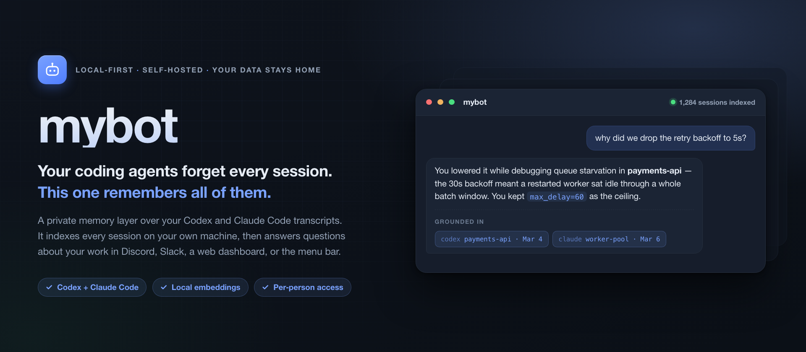
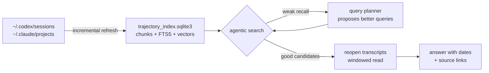

<p align="center">
  <picture>
    <source media="(prefers-color-scheme: dark)" srcset="docs/assets/hero-dark.png">
    <source media="(prefers-color-scheme: light)" srcset="docs/assets/hero-light.png">
    
  </picture>
</p>

<p align="center">
  
  
  
  
</p>

---

Every Claude Code and Codex session you have ever run is already sitting on your
disk as JSONL — thousands of conversations, commands, and command outputs that
are effectively write-only. You cannot grep your way back to "what did we decide
about the retry backoff, and why," because the answer is spread across a
transcript you no longer remember the name of.

mybot indexes those transcripts locally, then puts a search agent in front of
them. Ask a question in plain language and it searches, refines its own queries,
reopens the sessions that look relevant, and answers with dates and links back
to the exact transcript window it used. Nothing leaves your machine: the index,
the embeddings, and the model calls to your local CLI all stay local.

**Questions it is built to answer**

- *"Have I hit this error before?"* — and what actually fixed it.
- *"What was the config we settled on for the staging deploy?"* — with the date.
- *"Did that migration finish, or did I abandon it halfway?"*
- *"What did I decide about the schema, and what was the reasoning I rejected?"*

## Quickstart

Requires Python 3.11+, and at least one of [Claude Code](https://claude.com/claude-code)
or Codex CLI with existing session history. The first index of a large history
takes a while and lands in the hundreds of MB to a few GB — see
[Footprint](#footprint-and-background-behavior).

```bash
git clone https://github.com/jzhoulab/mybot.git ~/Code/mybot && cd ~/Code/mybot
python3 -m venv .venv && . .venv/bin/activate
python3 -m pip install -U pip && python3 -m pip install -r requirements.txt
cp .env.example .env
```

Then edit `.env`. The three things that matter on a first run:

| Setting | What to put |
|---|---|
| `MODEL_BACKEND` | `claude_cli`, `codex_cli`, or `openai_compatible` — plus that backend's vars ([details](#model-backends)) |
| `MEMORY_IMPORTED_OWNER_ID` | Any stable string for solo use; your Discord/Slack user id if you run a bridge |
| `TRAJECTORY_ACCESS_CONFIG_PATH`<br>`TRAJECTORY_INDEX_DB_PATH` | Absolute paths, so the server works when launched from anywhere |

Choose what mybot is allowed to read, then start it:

```bash
python -m client.setup_access            # interactive; --init-default to accept everything
python3 standalone_agent_backbone.py --host 127.0.0.1 --port 8788
```

The first start indexes your history and, in the background, works out who you
are from your own transcripts. When it settles:

```bash
curl -s http://127.0.0.1:8788/health
open http://127.0.0.1:8788/gui          # scope, footprint, and a retrieval probe
```

Index refresh writes keyword search immediately and fills in embeddings
gradually. To force the rest:

```bash
python scripts/mybot_admin.py maintenance --action embed   # repeat until missing_embeddings is 0
```

## The four ways to reach it

| Surface | Start it with | Good for |
|---|---|---|
| **Web dashboard** | already running at `/gui` | Seeing what is indexed, tuning scope, probing retrieval and its scores |
| **macOS menu bar** | `./macapp/build.sh release && open macapp/.dist/mybot.app` | Day-to-day asking, browsing transcripts, per-project include/exclude |
| **Agent skill** | `sh skills/mybot-memory/install.sh` | Letting your *other* Claude Code and Codex sessions query your history mid-task |
| **Discord / Slack** | `python scripts/mybot_admin.py connect discord` then `./run_discord_chatbot.sh` | Asking from your phone, and letting teammates ask |

The menu-bar app reads the index SQLite directly, so browsing and search still
work with the server stopped. Set `MYBOT_HOME` if your checkout is not at
`~/Code/mybot`. It needs macOS 14+.

The Discord and Slack bridges take `!team`, `!ask @user`, `!remember`,
`!remember-shared`, `!sources`, `!iam`, and `!new`. The launchers supervise:
they start the server if it is not healthy, restart the bridge with exponential
backoff, and hold a single-instance lock.

## How retrieval works



**Indexing.** Transcripts are cleaned and split into ~4800-character chunks with
800 characters of overlap, stored in SQLite with an FTS5 index over title, cwd,
and text, plus float32 embeddings from a local
`sentence-transformers/all-MiniLM-L6-v2`. Refresh is incremental: unchanged
sessions are left alone, changed ones are re-chunked, and sessions that fall out
of your visibility rules are deleted from the index.

**Search** is hybrid by default. FTS5 handles phrases and identifiers, with a
literal/proximity fallback for identifier-shaped queries; vectors then rerank
that bounded candidate set rather than scanning everything. Scores get a
recency bonus weighted much harder when the question implies "currently", and
each session is capped at two chunks so one long session cannot crowd out the
rest.

**The agentic loop** is what makes vague questions work. A first pass searches
the chunk index, semantic memory, and lexical memory. If recall looks weak,
heuristic query variants go next; if it is *still* weak, a cheap model tier
proposes precise queries and iterates, bounded by a hard wall-clock budget
(`TRAJECTORY_SEARCH_TIME_BUDGET_SECONDS`, default 25s) and an early stop once a
round stops improving the top score. Entities discovered along the way are
folded into the query used to extract evidence, which is how command output that
the original phrasing would never have matched still gets found.

**Answering.** The top candidates get reopened for a windowed read, budgeted to
`TRAJECTORY_EVIDENCE_CHARS`, and passed to the model as explicit evidence. With
`AGENTIC_TOOL_ROUTING=true` (default) the answering agent instead gets a
read-only retrieval CLI in an isolated runtime directory and decides for itself
when to search — every tool call carrying the same actor and scope, so it cannot
see more than the asker is allowed to see.

Pass `"return_trace": true` to `/trajectory/search` to see every stage, or use
the retrieval probe in `/gui` to watch ranking decisions directly.

## What mybot can see

This is the part worth configuring carefully, because the index is built from
everything you have ever typed at a coding agent.

Visibility lives in `config/access.json` (gitignored — it describes your local
paths). Write it with `python -m client.setup_access`, or edit scope live from
`/gui` and the menu app. Each source root is independently:

- **enabled or not** — a root you never enable is never read.
- **blacklist or whitelist** (`visibility_mode`) — allow everything except
  exclusions, or only what you list.
- filtered by **workdir** (path fragments, full paths, or path components) and by
  **workdir class** (`codex_project`, `codex_no_project`, `empty_workdir`, …).
- filtered by **Claude entrypoint** — e.g. exclude `sdk-cli` to drop
  programmatic invocations while keeping sessions you actually typed.
- filtered by **origin** — `exclude_automated`, or per-cluster via
  `excluded_origin_details` (`subagent`, `sdk`, `exec`, `no-user-turns`,
  `orchestrated`), so agent-launched runs do not read as your own work.

Three tiers result:

| Tier | Indexed? | Who can retrieve it |
|---|---|---|
| Excluded | No — and already-indexed chunks are purged when policy changes | Nobody |
| Visible | Yes | Whoever the bot serves |
| **Owner-private** (`private_workdirs`, `private_workdir_classes`) | Yes | Only the owner, guest access on or off |

The owner-private tier is enforced against *live* policy on every request rather
than a stamp from index time, so tightening `config/access.json` takes effect
immediately. `private_workdirs` matches an exact cwd — a prefix rule for your
home directory would swallow every project under it.

Two things to know before pointing a bridge at a shared channel. `/trajectory/sql`
is **owner-only outright**, because raw SQL cannot be row-filtered the way
search results can. And whoever the channel allowlist admits can read whatever
the bot can read — gate with `DISCORD_ALLOWED_CHANNEL_IDS` and the scope
controls, and set `GUEST_OWNER_ACCESS=false` if teammates should not reach your
trajectory history at all.

Everything binds to `127.0.0.1`. Only the two sync endpoints take a bearer
token; the rest are protected by the loopback bind plus per-actor policy checks.
Do not expose the port directly — put it behind a private path such as
Tailscale, a LAN-only interface, or an SSH tunnel.

## Using it as a team

Each person runs their own instance over their own history. The bot acts as its
owner's representative, so a teammate can ask "what did Alex do with the nightly
training run?" in Discord or Slack without interrupting Alex — bounded by the
visibility rules above. Bots auto-name themselves `<owner-handle>-mybot` per
server so a team's instances stay distinguishable.

Guests get their own private memory (`!remember`) and shared team notes
(`!remember-shared`), and mybot keeps a light person registry (display name,
first and last seen, recent topics) so it can greet a returning teammate with
context instead of starting cold. In group channels one session is shared per
channel, with each turn attributed by display name, and non-addressed messages
in explicitly listed channels are recorded without a reply so "what did Sam say
about the rollback?" is answerable later.

See [docs/multi-user.md](docs/multi-user.md) for session routing, idle rollover,
and the per-platform actor-id caveat. Cross-bot relay is receiver-side only so
far — treat it as experimental.

## Model backends

`MODEL_BACKEND` picks one of three. Both CLI backends stream, which is what
drives the live tool-call pills in the menu app.

| Backend | Uses | Key vars |
|---|---|---|
| `claude_cli` | your local Claude Code CLI and its auth | `CLAUDE_COMMAND`, `CLAUDE_MODEL` (default `opus`), `CLAUDE_THINKING`, `CLAUDE_BASH_SANDBOX` |
| `codex_cli` | your local Codex CLI and its auth | `CODEX_COMMAND`, `CODEX_MODEL`, `CODEX_REASONING_EFFORT`, `CODEX_PERMISSION_PROFILE` |
| `openai_compatible` | any HTTP endpoint | `MODEL_BASE_URL`, `MODEL_API_KEY`, `MODEL_NAME`, `MODEL_API_STYLE` |

Switch backend, model, or thinking depth at runtime — the menu app writes
`state/model_config.json`, which the server rereads per request with no restart.
`/health` reports what is actually in effect.

Both CLI backends are sandboxed per invocation. mybot runs Codex with
`--ignore-user-config`, so your `~/.codex/config.toml` does **not** apply and the
model and reasoning effort must be set here. The agent's own shell gets home
denied except its runtime workspace, and networking restricted to localhost, so
trajectory visibility is decided by mybot's access layer rather than by what the
agent could read off disk.

<details>
<summary><b>Configuration reference</b></summary>

Full annotated list in [`.env.example`](.env.example). The settings you are
most likely to touch:

**Retrieval**

| Variable | Default | Effect |
|---|---|---|
| `TRAJECTORY_SOURCES` | `codex,claude` | Which adapters are active |
| `TRAJECTORY_INVESTIGATION_MODE` | `auto` | `auto` \| `off` \| `full_scan` (slow comparison mode) |
| `TRAJECTORY_SEARCH_LIMIT` | `5` | Candidates carried forward |
| `TRAJECTORY_EVIDENCE_LIMIT` / `_CHARS` | `2` / `18000` | How many sessions get reopened, and the total character budget |
| `TRAJECTORY_QUERY_PLANNER` | `true` | Let the model propose better queries when recall is weak |
| `TRAJECTORY_SEARCH_TIME_BUDGET_SECONDS` | `25` | Hard cap on one agentic search |
| `MYBOT_TOOL_TOTAL_BUDGET_SECONDS` | `90` | Total retrieval time across all tool calls in one turn |
| `TRAJECTORY_QUERY_HINTS` | — | `keyword=extra terms` pairs to teach retrieval your own jargon |
| `AGENTIC_TOOL_ROUTING` | `true` | Give the answering agent a retrieval CLI instead of pre-fetching |

**Index**

| Variable | Default | Effect |
|---|---|---|
| `TRAJECTORY_INDEX_CHUNK_CHARS` / `_OVERLAP_CHARS` | `4800` / `800` | Chunk geometry |
| `TRAJECTORY_INDEX_AUTOBUILD` | `true` | Refresh when raw files are newer than the index |
| `TRAJECTORY_INDEX_AUTOBUILD_VECTORS` | `false` | Embed during refresh; leaving it off keeps refresh fast |
| `TRAJECTORY_INDEX_BACKGROUND_REFRESH_SECONDS` | `300` | Keep the index warm between questions |
| `TRAJECTORY_INDEX_PAUSE_ON_BATTERY` | `true` | Skip unattended indexing on battery |
| `EMBEDDING_MODEL_NAME` | `sentence-transformers/all-MiniLM-L6-v2` | Local embedding model |

**Sessions and context**

| Variable | Default | Effect |
|---|---|---|
| `HISTORY_MAX_MESSAGES` / `SESSION_TAIL_PAIRS` | `24` / `12` | How much conversation stays verbatim |
| `COMPACTION_TRIGGER_MESSAGES` / `_CHARS` | `40` / `16000` | When a session compacts into a rolling summary |
| `SESSION_IDLE_ROLLOVER_SECONDS` | `6h` | Idle gap before a fresh session with a carry-forward line |
| `GUEST_OWNER_ACCESS` | `true` | Whether guests may query the owner's trajectories |

</details>

<details>
<summary><b>HTTP API</b></summary>

All POST bodies are JSON. Only `/memory/import-batch` and `/memory/sync-status`
require `Authorization: Bearer <token>`.

**Ask**

| Endpoint | Purpose |
|---|---|
| `POST /chat` | One turn: retrieve, assemble the prompt, answer, persist the turn and its sources |
| `POST /chat/stream` | Same, as SSE — streams tool activity and text, then a final `done` event |

`/chat` takes `actor_id`, `user`, `session_key`, `message`, `memory_scope`
(`private` \| `shared` \| `target_user`), `target_user_id`, and `return_sources`;
it returns `memory_scope_used`, `session_summary_used`, and `sources`.

**Search and read**

| Endpoint | Purpose |
|---|---|
| `POST /trajectory/search` | Agentic search with no answer generated. Supports `limit`, `after`/`before`, `source`, `return_trace`, `full_scan` |
| `POST /trajectory/read` | Read a parsed trajectory by `source_ref`, windowed by `chunk_id` / `around_event`, bounded by `max_chars` |
| `POST /trajectory/sql` | **Owner-only.** Read-only `SELECT` over the chunk index, with `REGEXP` helpers injected |
| `POST /memory/search` | Search promoted notes by scope |
| `GET /memory` | Dump the overview index and semantic-memory stats |

**Index maintenance**

| Endpoint | Purpose |
|---|---|
| `POST /trajectory/index/rebuild` | Full rebuild from allowed roots |
| `POST /trajectory/index/embed` | Backfill embeddings in batches |
| `POST /trajectory/index/stats` | Chunk, session, and embedding counts; freshness; footprint |
| `POST /memory/rebuild` | Rebuild the semantic/overview memory index |

**Sessions, people, and owner**

| Endpoint | Purpose |
|---|---|
| `POST /sessions/history` \| `/sessions/list` \| `/sessions/reset` | Load a transcript, list threads under a key prefix, archive and start fresh |
| `POST /sessions/observe` | Record a non-addressed channel message as an attributed turn — no model call, no reply |
| `POST /memory/promote` | Store a private or shared note |
| `POST /owner/identity` | `get` / `set` / `investigate` the owner identity (`set` is owner-only) |
| `POST /owner/profile` | Get, regenerate, or save `profiles/default/USER.md` |

**Dashboard and health**

| Endpoint | Purpose |
|---|---|
| `GET /gui` \| `GET /gui/state` | The dashboard, and the JSON behind it |
| `POST /gui/query` \| `/gui/scope` \| `/gui/maintenance` | Retrieval probe; read or change visibility; kick off maintenance |
| `GET /health` | Liveness, effective backend/model/thinking, bot name, index and battery status |

**Multi-machine sync** (optional; distinct from local indexing)

| Endpoint | Purpose |
|---|---|
| `POST /memory/import-batch` | Idempotent upload of normalized records from a remote client |
| `POST /memory/sync-status` | Server-side view of what an actor has synced per source |

Set up tokens by copying `config/sync_tokens.example.json` to
`config/sync_tokens.json` — one record per person, binding a sha256 token hash
to an actor id:

```bash
python3 -c 'import hashlib,getpass; print(hashlib.sha256(getpass.getpass("token: ").encode()).hexdigest())'
```

Then push from the other machine with
`python -m client.sync_trajectories sync --server http://host:8788 --actor-id <id> --sources codex,claude --token <token>`.

</details>

## Footprint and background behavior

The chunk index is the big artifact — expect hundreds of MB to several GB
depending on how much history you have, with embeddings roughly five times
smaller than the text. `/gui` reports the live footprint and flags when raw
transcripts are newer than the index. `POST /trajectory/index/stats` gives the
same numbers as JSON.

Two behaviors surprise people:

- **Unattended indexing pauses on battery** (`TRAJECTORY_INDEX_PAUSE_ON_BATTERY`,
  default on) so mybot does not quietly drain a laptop. Searches you initiate
  still refresh on demand. `/health` reports
  `index_refresh_paused_on_battery`.
- **Autobuild refresh skips embeddings** by default so it stays fast. Keyword
  search is immediately current; vector search lags until you backfill with
  `maintenance --action embed`.

Snapshot the databases, transcripts, and token config with
`./scripts/backup_state.sh` (set `BACKUP_DIR` to relocate the archive).

If you develop against a running install, `./scripts/deploy.sh` pushes, rebuilds
and reinstalls the menu app, restarts the server and bridge, refreshes the agent
skill, and prints a drift report so the copies cannot silently diverge.

## Troubleshooting

| Symptom | Likely cause |
|---|---|
| Private-scope search returns nothing | `MEMORY_IMPORTED_OWNER_ID` does not match the `actor_id` your client sends |
| Menu app shows no data | Checkout is not at `~/Code/mybot` and `MYBOT_HOME` is unset |
| Vector search misses obvious hits | Embeddings not backfilled yet — check `missing_embeddings` in index stats |
| Index looks stale and will not catch up | On battery, with `TRAJECTORY_INDEX_PAUSE_ON_BATTERY` on |
| Codex ignores your configured model | Expected — mybot passes `--ignore-user-config`; set `CODEX_MODEL` in `.env` |
| Bot silent in a guild channel | Enable **Message Content Intent** in the Discord Developer Portal, and check `DISCORD_ALLOWED_CHANNEL_IDS` |
| Sync endpoints return 503 | `config/sync_tokens.json` not configured — everything else works without it |

## Repo layout

```
app/          server, bridges, dashboard, semantic memory, chunk index
sources/      trajectory adapters (codex, claude), access policy, origin classification
client/       access-setup TUI, remote sync CLI
scripts/      admin CLI, agent retrieval tool, deploy, backup
skills/       the skill that lets other coding agents query mybot
macapp/       macOS menu-bar app (SwiftUI)
profiles/     prompt and persona files
config/       access and sync-token examples
docs/         multi-user model, agent-session convention
state/        local runtime data — gitignored, never leaves the machine
```

Top-level `standalone_agent_backbone.py`, `discord_bridge.py`, and
`slack_bridge.py` are thin entrypoints into `app/`.

Further reading: [docs/multi-user.md](docs/multi-user.md) for the multi-instance
model, and [docs/agent-session-convention.md](docs/agent-session-convention.md)
for the one-line marker that lets any orchestrator tell mybot "a program typed
this, not a human."

## License

MIT — see [LICENSE](LICENSE).
